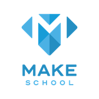

# Make Checkin

</a>

## Description

Are you lazy and don't want to go to your dashboard and plug in the acccess token to mark your attendance as present, well try Make Checkin.

### Prerequisites

What things you need to install the software and how to install them

```bash
- brew
- python 3.4+
- pipenv
```

## Getting Started

The python modules were configured in a virtual enviornment with `pipenv`:

#### macOS Mojave 10.0+

```bash
# (if you have pipenv installed skip this step)
brew install pipenv
# clone repository
git clone https://github.com/tempor1s/make-checkin
# active the virtual enviornment
pipenv shell
# install modules into virtual environment
pipenv install
# start script
python3 main.py <CODE>
# example
python3 main.py BRAVE
```

#### apt systems Ubuntu, Debian, Mint, Etc

```bash
# install pipenv
sudo pip install pipenv
# clone repository
git clone https://github.com/tempor1s/make-checkin
# active the virtual enviornment
pipenv shell
# install modules into virtual environment
pipenv install
# start script
python3 main.py <CODE>
# example
python3 main.py BRAVE
```

This also assumes that you have `brew` installed. After cloning the repository in desired directory we run the command `pipenv shell` to initialize and activate our virtual enviornment. Unless specified pipenv will default to whatever virtualenv defaults to. We then allow pipenv to find and install the necessary modules for our server. All modules can be viewed inside the file `Pipfile` under the [packages] section.

## How to Run Script

It is essential that you are on the connected the `MakeStudent` SSID. (wifi) After installation and setup you can run the simple command as followed:

```bash
# replace code with your class code
python3 main.py <CODE>
# as followed
python main.py BRAVE
```


After entering command you should see a message from the MakeSchool website in the CLI that notifies you what was returned.

## How to contribute

Fork the current repository and then make the changes that you'd like to said fork. Upon adding features, fixing bugs,
or whatever modifications you've made to the project, issue a pull request to this repository containing the changes that you've made!

## Built With

-   [Requests](https://2.python-requests.org/en/master/) - HTTP library
-   [lxml](https://lxml.de/) - XML and HTML parsing library

## Authors

-   **Ben Lafferty** - _Initial idea / CLI implementation_ - [tempor1s](https://github.com/tempor1s)
-   **Gary Frederick** - _Initial work_ - [imthaghost](https://github.com/imthaghost)

See also the list of [contributors](https://github.com/tempor1s/make-checkin/contributors) who participated in this project.
